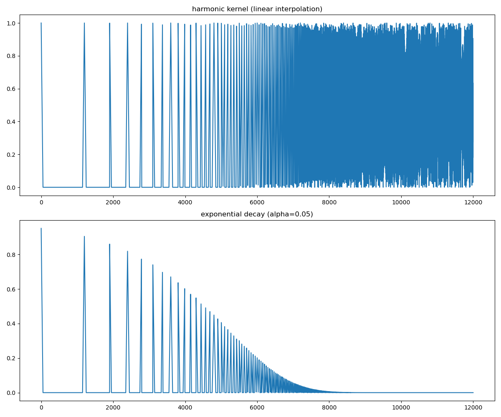
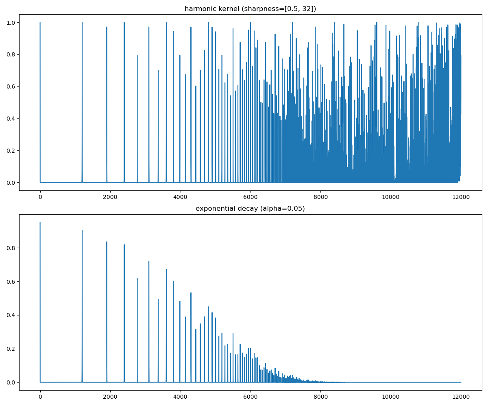
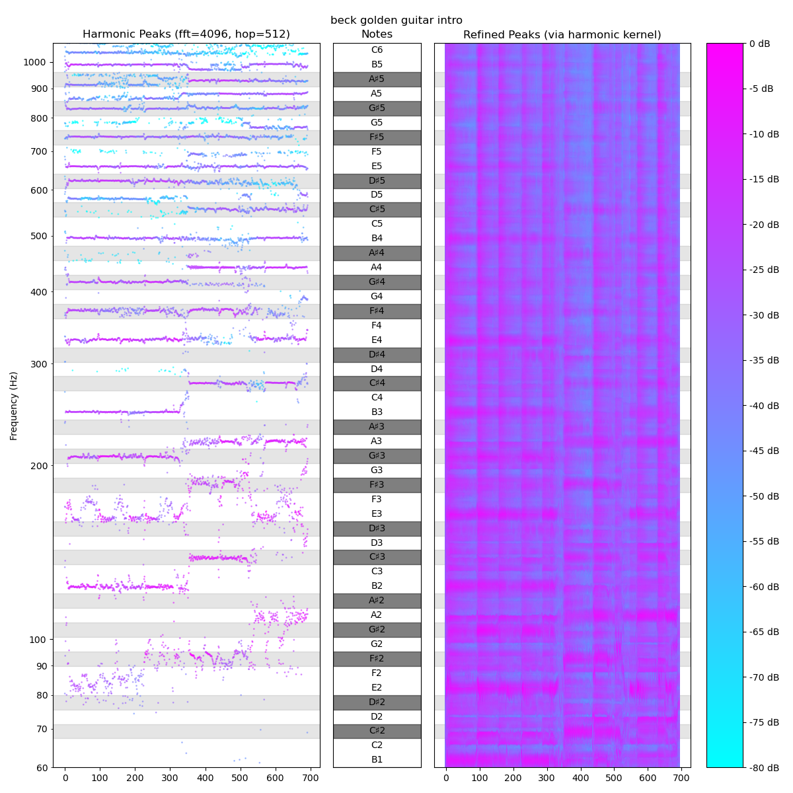
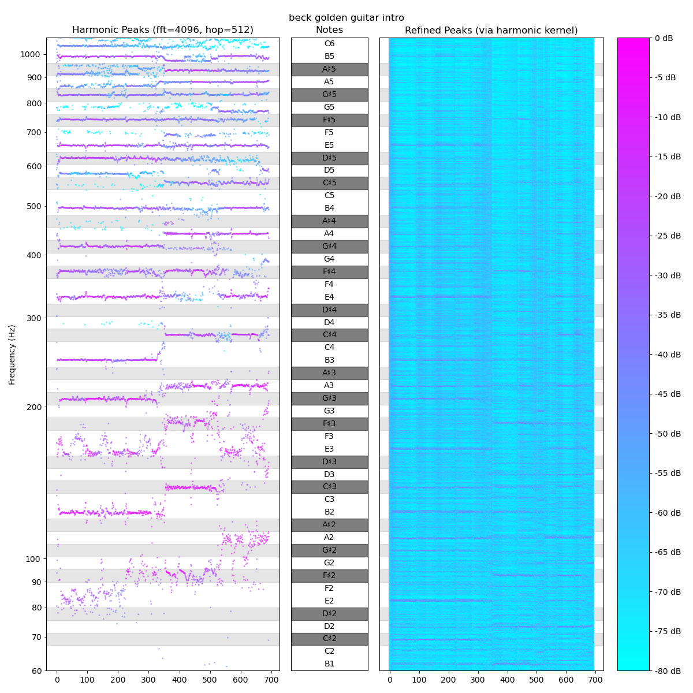
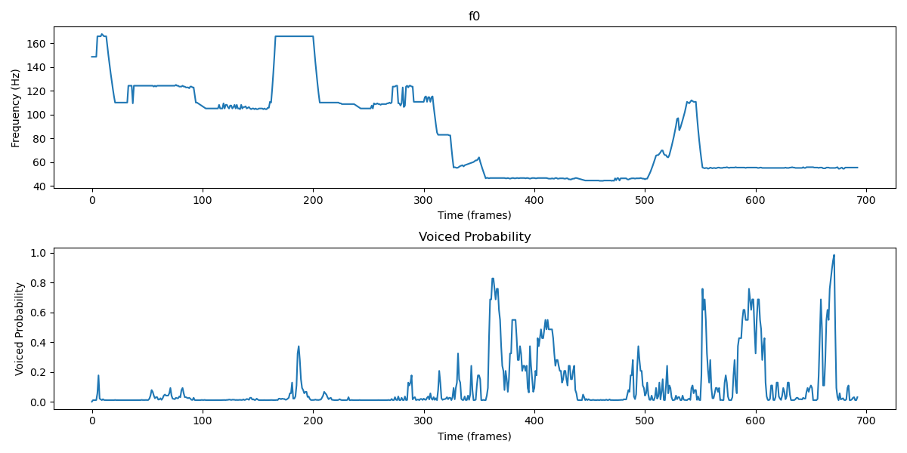
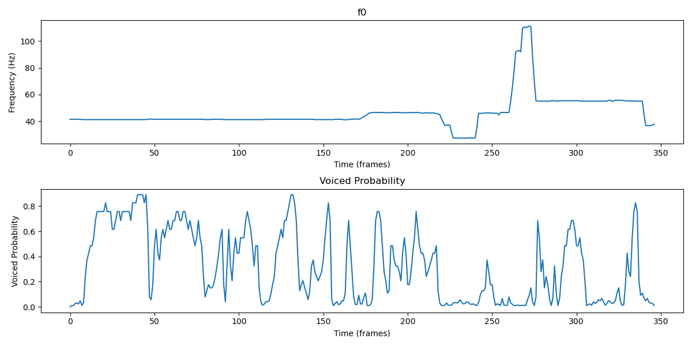
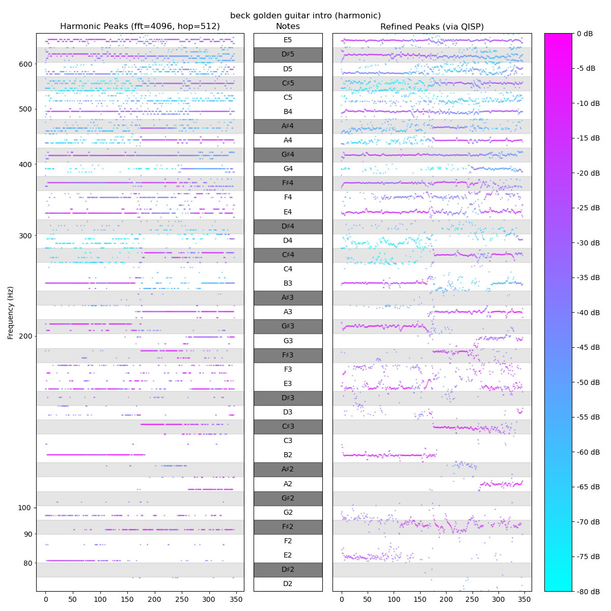

# Note Extraction

Working on polyphonic pitch detection, it seems there are a number of ways to create sets of candidate frequencies for fundamentals. The magnitude of QISP-refined spectral peaks would be the most straightforward solution (from where I am in the project). Otherwise, there are a few established methods and an experimental method I have been working on.

## Experimental "Harmonic Kernel"
I implemented a "harmonic kernel" solution (this seems conceptually similar to [Harmonic Product Spectrum](http://musicweb.ucsd.edu/~trsmyth/analysis/Harmonic_Product_Spectrum.html)) for detecting fundamental frequencies. The idea is to create a `1xN` kernel, with `N` frequency bins evenly spaced along a log2-scaled axis (e.g. bin zero would be an interval of zero cents, or a "unison"; bin 10 would represent an interval of ten cents, etc.). Then we populate the frequency bins with values between zero and one, following a distribution that peaks at intervals that match natural harmonics.

Initially, I tried simple linear interpolation to zero between peaks. Then I tried adding exponential decay as we progress into higher harmonics (at around ten octaves, the harmonics start to get pretty thick for 1-cent resolution).

Here is a fairly raw example (using exponential decay):

After tweaking the kernel shape a bit more, I was able to get fairly distinct horizontal lines at fundamentals (along with some artifical emphasis of related notes). We can see many intervals in the key are reinforced by the kernel, but this is far from conclusive.

## Moving Forward
Ultimately, I think there may not be a "perfect" kernel to use for such a solution, so at this point, I think it is best to choose a provisional solution for note extraction and proceed with the subsequent steps. Librosa supports pYIN, which seems like one of the strongest candidates, for performance reasons (including time performance, where it certainly outperforms my initial implementation of the "harmonic kernel" solution). CREPE seems to do better, but that is a CNN-based solution and initial tests with pYIN were very promising.

I found something interesting when I accidentally loaded my test sample at a lower sample rate. It looks like maybe the implicit low-pass filter that comes along with lower sample rates actually improved fundamental detection via pYIN. Here we see the fundamentals detected actually follow the bassline much better than when sampled at 44.1kH.

It took some thinking to determine what had happened. It seemed counter-intuitive that low-frequency resolution would be directly and beneficially impacted by decreasing the sample rate, but you can see the improvement in the QISP-refined peaks. Compare the spectrograms above with this one (particularly in the frequency range from ~E2 to A2).

At first I though it may be caused by interference from artifacts in higher frequencies that are mitigated by the lower high pass filter for 22050Hz, but then I remembered the area we are working in (i.e. post-FFT) is subject to the same fundamental limitations as the famous Heisenberg uncertainty principle; in the context of a spectrograph analysis of audio signals, the trade-off is between frequency (analogous to momentum/energy) and timing (as position).

In this context of frequency/timing tradeoff, the window size decides the weighting (smaller windows give better time resolution and larger windows give better frequency resolution) and when I accidentally halved the sample rate, my window size was essentially doubled.

I originally chose:
* sr=44.1kHz, nfft=4096 -> ~93ms window size
* and 512-sample stride -> ~12ms stride

I found better results via pYIN with:
* sr=22050Hz, nfft=4096 -> ~186ms window size
* and 512-sample stride -> ~23ms stride

In this paper on [Detecting Harmonic Change in Musical Audio](https://dl.acm.org/doi/pdf/10.1145/1178723.1178727), they also chose a larger window, eight times larger than I originally intended:
* window=743ms
* stride=93ms

Since I am focused on harmonic information, I may want to adopt their numbers and tradeoff some time resolution for frequency resolution.

## Other Techniques
I also found [PITCH DETECTION METHODS REVIEW](https://ccrma.stanford.edu/~pdelac/154/m154paper.htm), which seems like a decent summary of a few diverse techniques.