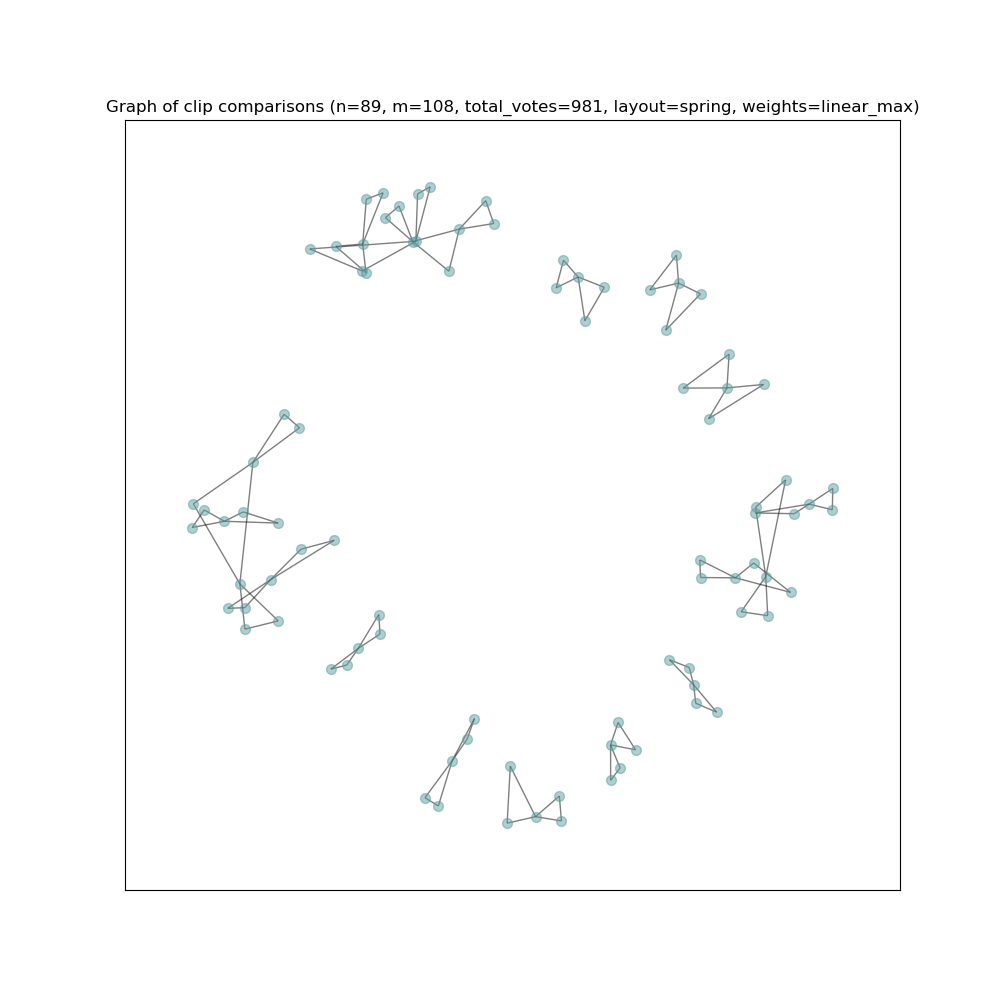
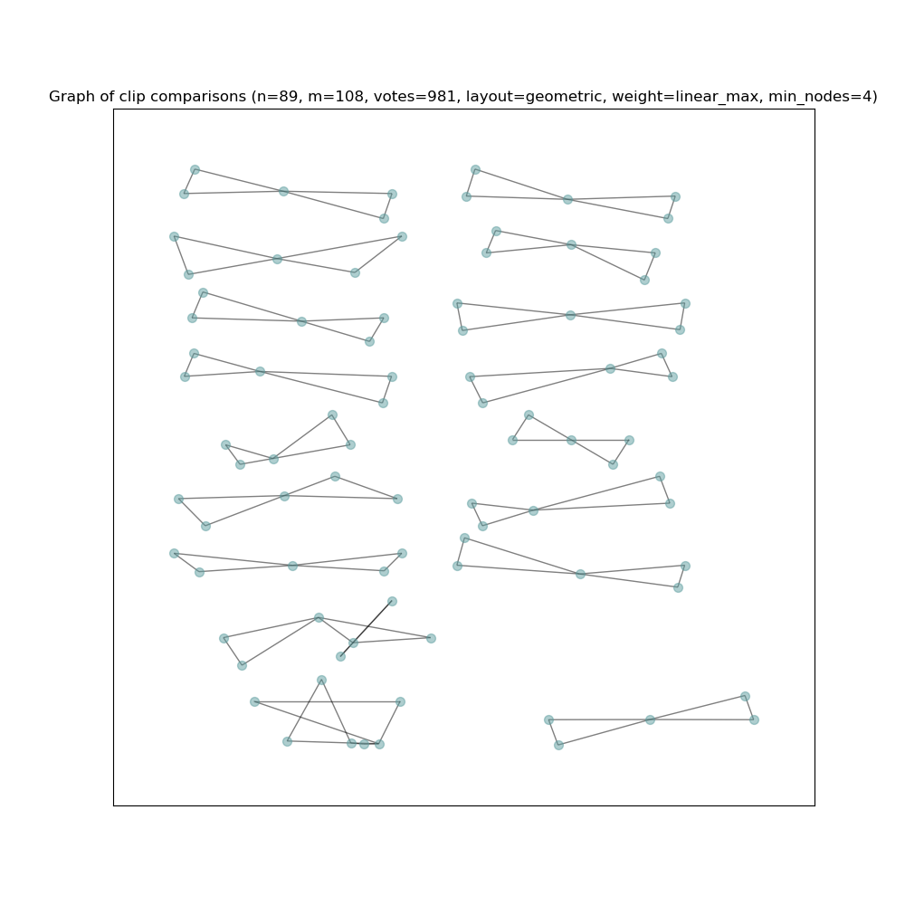
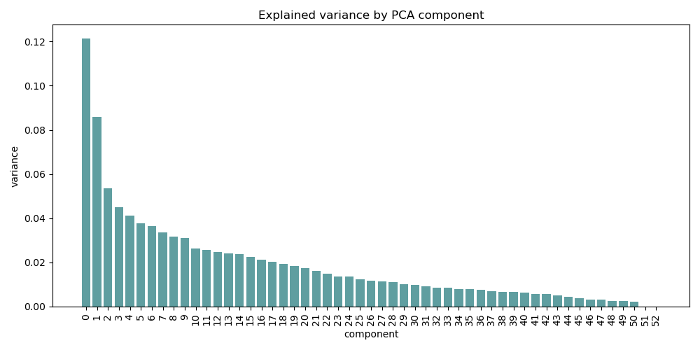

# Reference Metrics

I parsed the user votes data for which of a given triple of clips was most dissimilar and created some different graph views, with edge weights inversely proportional to the sum of votes received by constituent nodes (i.e. pushing clips with more "dissimilar" votes further apart during graph rendering). There were a lot of isolated three-clique communities (i.e. disconnected triples), which only seemed to serve to clutter the view, so I kept them out of the main plot. After trying a few different layouts, I found two that seemed best suited to this data: the spring layout and geometric layout. The spring layout provide a more "naturalistic" view, where the elements seem to repel each other on the basis of dissimilarity, but we should remember that the amount space between disconnected components in these graphs is arbitrary:

The geometric layout looks more like a specimen collection, with connected components laid out as in a display case:

# Candidate metrics

As the winter storm and corresponding power loss has occupied much of my attention over the last week, I did not make as much progress as I intended to over the weekend. I did start assessing collinearity of my metrics. Looking at the explained variance per principal component I noticed a few components at the end of the list that add nothing to the model:

I found that file count and duration were perfectly collinear, and file size was close. I decided to remove file count and total duration, because they seem just slightly more arbitrary than file size. Since the codec and corresponding settings are the same for all the clips in my dataset, I *can* use it as a rough proxy for information density and sonic complexity. This seems to be marginally viable, as a curiosity during development, but will likely not generalize to new data, since I will not always be operating on data that was collected by the exact same process.

# Improving preprocessing time performance

Again, due to the extensive loss of power, stretching through most of the weekend and into this week, I was unable to compute as much as I intended, but I was able to develop a [work queue utility](https://github.com/jhautala/phonemes/blob/main/src/utils/work.py) for distributing work items to separate processes for collection by a manager process. This should allow me to scale my preprocessing task to saturate my compute capacity and improve throughput for subsequent iterations. Since my utility is abstract, and I carefully handle errors, logging, and such, it will be useful in other similar tasks where I want to distribute work to sub-processes.