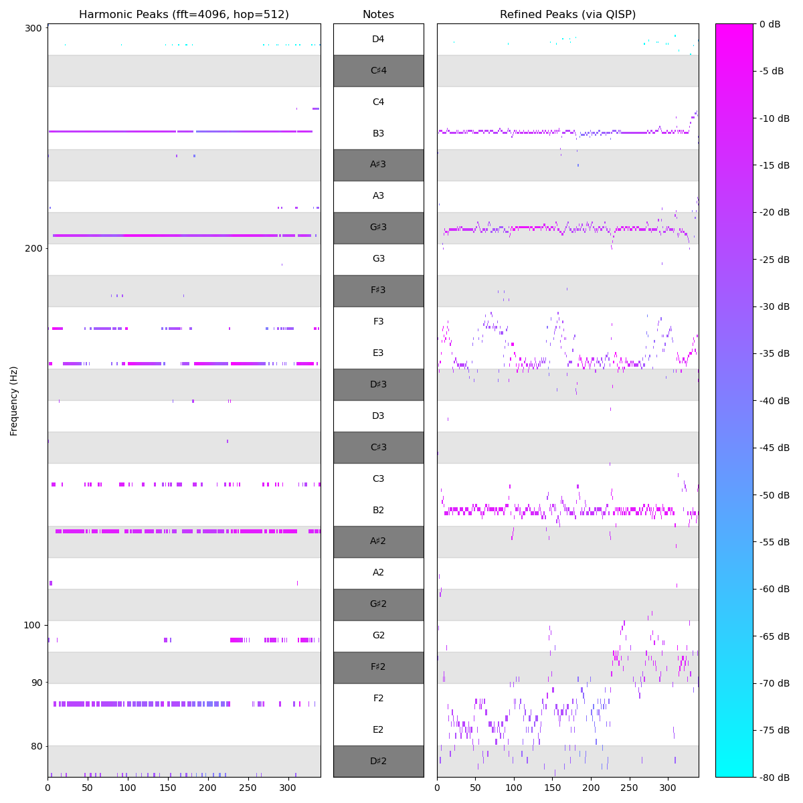

Data Source: [MagnaTagATune Dataset](https://mirg.city.ac.uk/codeapps/the-magnatagatune-dataset)
Reference: [MagnaTagATune List](https://github.com/keunwoochoi/magnatagatune-list)

Steps: Download, unzip, copy to internal drive

Overview output:

    found 25863 files unique conformant MP3 files, in 16 directories,
    representing 5405 musical pieces, 0 empty dirs and 0 unexpected files

Extracted Metadata (head):

|   | prefix          | file_count | dir | duration |   size |
|---|-----------------|------------|-----|----------|--------|
| 0 | american_b...   |          6 |   0 |      174 | 703507 |
| 1 | american_b...   |          4 |   0 |      116 | 468974 |
| 2 | american_b...   |          6 |   0 |      174 | 703475 |
| 3 | american_b...   |          3 |   0 |       87 | 351759 |
| 4 | american_b...   |          3 |   0 |       87 | 351758 |

Descriptive Stats:

|            | file_count | duration |       size |
|------------|------------|----------|------------|
| count      |    5405.00 |  5405.00 |    5405.00 |
| mean       |       4.79 |   138.77 |  560900.36 |
| std        |       3.74 |   108.53 |  438711.56 |
| min        |       1.00 |    29.00 |  117151.00 |
| 25%        |       3.00 |    87.00 |  351632.00 |
| 50%        |       4.00 |   116.00 |  468946.00 |
| 75%        |       6.00 |   174.00 |  703378.00 |
| max        |      75.00 |  2175.00 | 8790094.00 |

We can use some of the same tools we developed during initial experimentation, to analyze the official MagnmaTagATune data.

